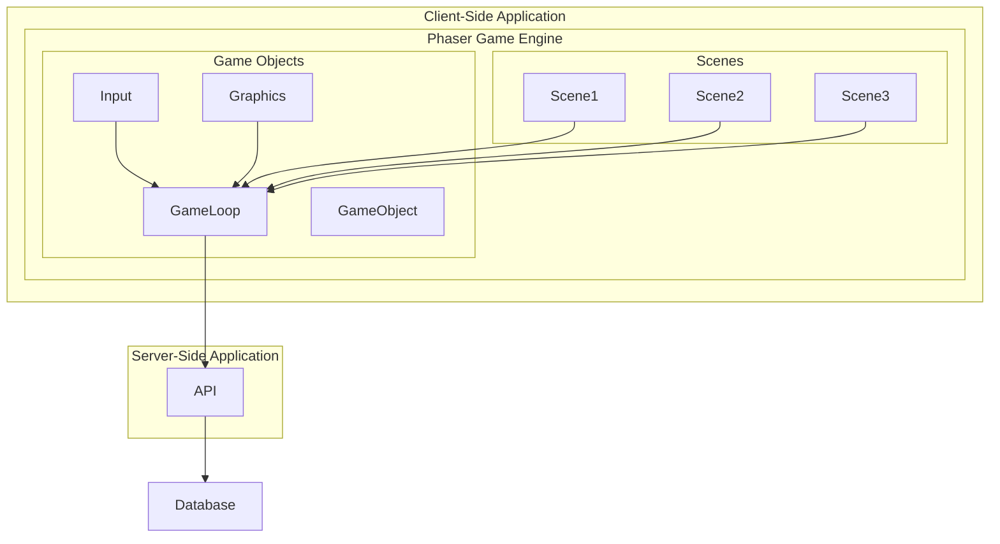

## Architecture Diagram

## Core Concepts in Phaser

- **Game:** Represents the main game instance and manages the game loop, configuration, and global game settings.

- **Scenes:** Scenes are the primary building blocks of a game in Phaser. Each scene typically represents a specific game state or level, such as a menu, gameplay level, or game over screen.

- **Game Objects:** Game objects are entities within the game world that can be displayed, interacted with, and manipulated. Examples include sprites, text, images, buttons, and shapes.

- **Sprites:** Sprites are game objects that represent visual elements within the game, such as characters, items, or obstacles. Sprites can have animations, physics properties, and event handlers.

- **Physics:** Phaser provides built-in support for physics engines such as Arcade Physics and Matter.js. Physics can be applied to game objects to simulate realistic movement, collisions, and interactions.

- **Input:** Input handling allows players to interact with the game using various input devices, including keyboards, mice, touchscreens, and game controllers. Phaser provides easy-to-use input methods for handling player input.

- **Animation:** Phaser supports sprite-based animations, allowing developers to create dynamic and visually appealing animations for game characters, effects, and user interface elements.

- **Audio:** Audio management in Phaser allows developers to add sound effects, music, and other audio assets to their games. Phaser provides APIs for loading, playing, and controlling audio assets.

- **Scenes and Transitions:** Phaser allows developers to transition between different game scenes seamlessly. Transitions can include fading, sliding, or zooming effects to enhance the user experience.

- **Camera:** The camera in Phaser controls the viewport and determines what is visible to the player. Developers can manipulate the camera to create effects such as scrolling, zooming, and following game objects.

- **Tilemaps:** Phaser includes support for tile-based game worlds and provides tools for creating, loading, and manipulating tilemaps. Tilemaps are commonly used for creating levels and environments in 2D games.

- **Plugins:** Phaser supports a plugin architecture that allows developers to extend the framework's functionality with custom features, optimizations, or integrations.
